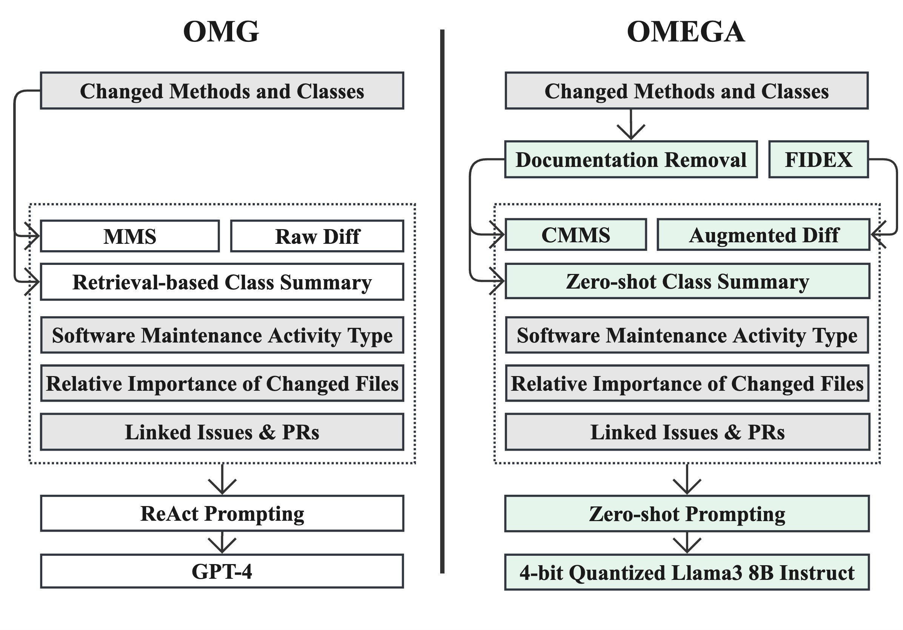

# Context Conquers Parameters: Outperforming Proprietary LLM in Commit Message Generation



## Candidate Models

### Candidate OLLMs

- [Llama3 70B Instruct AWQ](https://huggingface.co/TechxGenus/Meta-Llama-3-70B-Instruct-AWQ})
- [DeepSeek-Coder 33B AWQ](https://huggingface.co/TheBloke/deepseek-coder-33B-instruct-AWQ)

We quantized the following models using the [AutoAWQ](https://github.com/casper-hansen/AutoAWQ) library:

- [CodeFuse-DeepSeek-33B](https://huggingface.co/codefuse-ai/CodeFuse-DeepSeek-33B)
- [OpenCodeInterpreter-DS-33B](https://huggingface.co/m-a-p/OpenCodeInterpreter-DS-33B)

### Candidate SLMs

- [Llama3 8B Instruct AWQ](https://huggingface.co/casperhansen/llama-3-8b-instruct-awq)
- [Mistral 7B Instrucy v0.3 AWQ](https://huggingface.co/solidrust/Mistral-7B-Instruct-v0.3-AWQ)
- [CodeQwen1.5 7B Chat AWQ](https://huggingface.co/Qwen/CodeQwen1.5-7B-Chat-AWQ)

## Setup

1. Create the conda environment we used by running the following command:

```bash
conda env create --file ollm.yml
```

2. Setup the VLLM inference endpoint by refering to the [VLLM documentation](https://docs.vllm.ai/en/latest/getting_started/quickstart.html).
3. Create a `.env` file in the root directory with the following content:

```bash
INFERENCE_PORT=YOUR_INFERENCE_PORT
INFERENCE_URL=http://<YOUR_INFERENCE_ENDPOINT_IP_ADDRESS>/:${INFERENCE_PORT}/v1
USE_OPEN_SOURCE=1 # Set to 0 if you want to try GPT-4
OLLM_SERVER_TYPE=vllm 
MODEL_TEMPERATURE=0
MODEL_NAME=YOUR_MODEL_NAME # e.g. TechxGenus/Meta-Llama-3-70B-Instruct-AWQ
UNDERSTAND_PATH=THE_PATH_TO_UNDERSTAND_EXECUTABLE # e.g. /path/to/und
GITHUB_API_TOKEN=YOUR_GITHUB_API_TOKEN
OPENAI_API_KEY=YOUR_OPENAI_API_KEY # Only required if you want to use GPT-4
OPENAI_ORGANIZATION=YOUR_OPENAI_ORGANIZATION # Only required if you want to use GPT-4
```

4. Download the Java projects locally by running the following command:

```bash
cd CMG ; python download_projects.py
```

5. Download and unzip [`datasets.zip`](https://figshare.com/ndownloader/files/48005035?private_link=b7e5f33347c7faa51e5e) to the root directory of this project. (A folder named `data` should be available in the root directory after unzipping).

6. Download [`training_data_semantic_embedding.pt`](https://figshare.com/ndownloader/files/48005074?private_link=b7e5f33347c7faa51e5e) and copy it to the `CMG` folder.

7. Download [`java-jars.zip`](https://figshare.com/ndownloader/files/48005554?private_link=b7e5f33347c7faa51e5e) and unzip it to the `CMG` folder. It should create the JavaParser jar files in the `program_contexts` folder of the `CMG` folder.

7. Download [`MMS.zip`](https://figshare.com/ndownloader/files/48005545?private_link=b7e5f33347c7faa51e5e) and unzip it to the `CMG` folder. It should create the requires for MMS and CMMS in the `program_contexts` folder of the `CMG` folder.

## OLLMs' Performance in CMG With Different Diff Augmentation Techniques

### Mistral 7B Instruct v0.3 AWQ


| Diff Augmentation            | OMG_BLEU | OMG_METEOR | OMG_ROUGEL | HUMAN_BLEU | HUMAN_METEOR | HUMAN_ROUGEL |
| ------------------------------ | :--------: | :----------: | :----------: | ------------ | -------------- | -------------- |
| None                         |  10.86  |   31.67   |   28.28   | 0.58       | 13.96        | 7.16         |
| Diff Narrative               |  *11.65*  |   *32.65*   |   *29.65*   | **0.83**       | **14.94**        | **7.74**         |
| FIDEX-generated Diff Summary |  **12.29**  |   **33.85**   |   **29.76**   | *0.67*       | *14.79*        | *7.37*         |

### CodeQwen1.5 7B Chat AWQ

The changes for this model were not consistent due to the model's issue in repeating the same sentence in its output. See the CSV files in the `cmg_results/CodeQwen1.5-7B-Chat-AWQ` folder for the generated CMs by this model.


| Diff Augmentation            | OMG_BLEU | OMG_METEOR | OMG_ROUGEL | HUMAN_BLEU | HUMAN_METEOR | HUMAN_ROUGEL |
| ------------------------------ | :--------: | :----------: | :----------: | ------------ | -------------- | -------------- |
| None                         |   4.82   |  *28.40*  |  *21.75*  | 0.41       | 12.17        | 5.80         |
| Diff Narrative               | **5.08** |   28.34   | **22.36** | **0.53**   | **13.23**        | **6.54**       |
| FIDEX-generated Diff Summary |  *4.85*  | **29.26** |   21.63   | *0.47*       | *12.37*        | *5.82*         |

### Llama3 8B Instruct AWQ

Reported in the paper.

### Llama3 70B Instruct AWQ

| Diff Augmentation            | OMG_BLEU | OMG_METEOR | OMG_ROUGEL | HUMAN_BLEU | HUMAN_METEOR | HUMAN_ROUGEL |
| ------------------------------ | :--------: | :----------: | :----------: | ------------ | -------------- | -------------- |
| None                         |   14.19   |  36.44  |  32.06  | *0.95*       | 16.38        | 8.16         |
| FIDEX-generated Diff Summary |  **15.78**  | **38.02** |   **33.80**   | 0.88       | **17.12**        | **8.45**         |

## Files Structure

- `CMG`: Contains the scripts to download the Java projects and generate the commit messages.
- `cmg_results`: Contains the generated commit messages by each SLM/OLLM.
- `common`: Contains the common scripts used by the different models.
- `evaluation`: Contains the scripts for calculating our automatic evaluation metrics.
- `survey-1` to `survey-3`: Contains the survey data and the analysis scripts for each survey.
- `quantization`: Contains the scripts used to quantize two of the candidate OLLMs.
- `data`: Contains the datasets used in the paper.

## Running Scripts

### RQ1

1. Run the `Meta-Llama-3-70B-Instruct-AWQ` model for inference on your machine using VLLM.

2. Uncomment the `answering_instructions` variable that has the `# Original - Used For Survey` comment and comment out any other variable with the same name.

3. Run following command:

```bash
cd CMG
REMOVE_COMMENTS=FALSE METHOD_SUMMARIES=OLD python omega.py ../data/omg_data_preprocessed.csv all
```

### RQ2

1. Run the `Meta-Llama-3-70B-Instruct-AWQ` model for inference on your machine using VLLM.

2. Uncomment the `answering_instructions` variable that has the `# Modified - Used After Survey to make it more comprehensive` comment and comment out any other variable with the same name.

3. Run following command:

```bash
cd CMG
python omega.py ../data/omg_data_preprocessed.csv all
```

### RQ3

1. Run the `casperhansen/llama-3-8b-instruct-awq` model for inference on your machine using VLLM.

2. Uncomment the `answering_instructions` variable that has the `# Modified - Used After Survey to make it more comprehensive` comment and comment out any other variable with the same name.

3. Run following command to use Diff Narrative:

```bash
cd CMG
python omega.py ../data/omg_data_preprocessed.csv all --dn
```

4. Run following command to use FIDEX-generated Diff Summary:

```bash
cd CMG
python omega.py ../data/omg_data_preprocessed.csv all --fidex
```

## Citation
If you found this work helpful, please consider citing it using the following:

```bibtex
@misc{imani2024contextconquersparametersoutperforming,
      title={Context Conquers Parameters: Outperforming Proprietary LLM in Commit Message Generation}, 
      author={Aaron Imani and Iftekhar Ahmed and Mohammad Moshirpour},
      year={2024},
      eprint={2408.02502},
      archivePrefix={arXiv},
      primaryClass={cs.SE},
      url={https://arxiv.org/abs/2408.02502}, 
}
```
